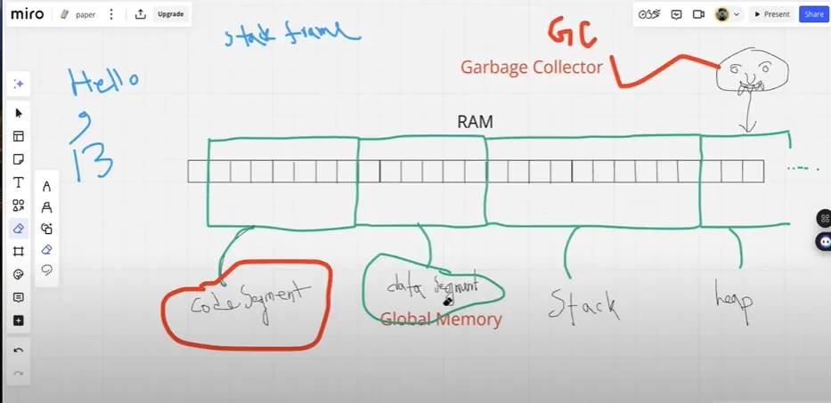
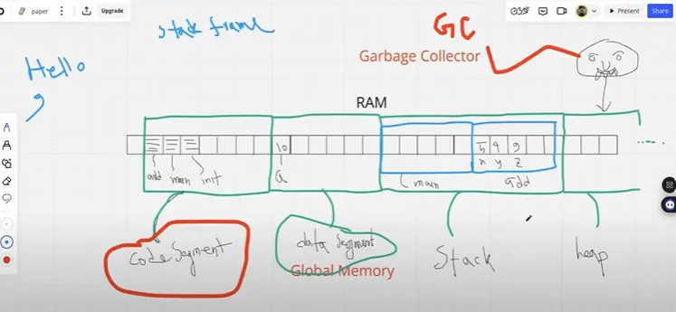

# Go Programming Language Guide

## Introduction
Go (Golang) is a statically typed, compiled programming language designed for simplicity and efficiency. It is widely used for system programming, cloud computing, and web development.

## Table of Contents
1. [Install Go](#install-go)
2. [Install VS Code](#install-vs-code)
3. [Hello World](#hello-world)
4. [Variables and Data Types](#variables-and-data-types)
5. [If-Else and Switch](#if-else-and-switch)
6. [Functions](#functions)
7. [Function Types](#function-types)
8. [Standard Functions](#standard-functions)
9. [Init Function](#init-function)
10. [Anonymous Function](#anonymous-function)
11. [Scope](#scope)
12. [Variable Shadowing](#variable-shadowing)
13. [Internal Memory](#internal-memory)

---

## Install Go

### Windows
1. Download Go from [https://go.dev/dl/](https://go.dev/dl/)
2. Run the installer and follow the setup instructions.
3. Verify installation by running:
   ```sh
   go version
   ```

### macOS
1. Install via Homebrew:
   ```sh
   brew install go
   ```
2. Verify installation:
   ```sh
   go version
   ```

### Linux
1. Download and extract Go:
   ```sh
   wget https://go.dev/dl/go1.x.x.linux-amd64.tar.gz
   sudo tar -C /usr/local -xzf go1.x.x.linux-amd64.tar.gz
   ```
2. Add Go to PATH:
   ```sh
   export PATH=$PATH:/usr/local/go/bin
   ```
3. Verify installation:
   ```sh
   go version
   ```

---

## Install VS Code
1. Download and install VS Code from [https://code.visualstudio.com/](https://code.visualstudio.com/)
2. Install the Go extension from the VS Code marketplace.
3. Open a Go file and verify syntax highlighting and linting.

---

## Hello World
Create a file `main.go`:
```go
package main

import "fmt"

func main() {
    fmt.Println("Hello, World!")
}
```
Run the program:
```sh
go run main.go
```

---

## Variables and Data Types

### Variable Declaration
```go
var name string = "John"
var age int = 25
```
### Short Declaration
```go
message := "Hello, Go!" // Type inferred
```
### Basic Data Types
```go
var x int = 10       // Integer
var y float64 = 3.14 // Float
var z bool = true    // Boolean
var str string = "Go Programming"
```

---

## If-Else and Switch
### If-Else
```go
if age >= 18 {
    fmt.Println("Adult")
} else {
    fmt.Println("Minor")
}
```

### Switch
```go
switch day := 3; day {
case 1:
    fmt.Println("Monday")
case 2:
    fmt.Println("Tuesday")
default:
    fmt.Println("Other day")
}
```

---

## Functions
```go
func add(a int, b int) int {
    return a + b
}
```

Calling the function:
```go
result := add(5, 3)
fmt.Println("Sum:", result)
```

---

## Function Types
### Function with Multiple Return Values
```go
func swap(a, b int) (int, int) {
    return b, a
}
```

### Variadic Function
```go
func sum(numbers ...int) int {
    total := 0
    for _, num := range numbers {
        total += num
    }
    return total
}
```

---

## Standard Functions
### Print Functions
```go
fmt.Println("Hello, Go!")
fmt.Printf("Value: %d", 42)
```
### String Manipulation
```go
str := "hello"
fmt.Println(strings.ToUpper(str))
```

---

## Init Function
The `init` function is executed before the `main` function and is used for initialization.
```go
package main

import "fmt"

func init() {
    fmt.Println("Initializing...")
}

func main() {
    fmt.Println("Main function execution")
}
```

---

## Anonymous Function
Anonymous functions are functions without a name and are often used as inline functions.
```go
package main

import "fmt"

func main() {
    func(msg string) {
        fmt.Println(msg)
    }("Hello from anonymous function!")
}
```

---

## Scope
### Global Scope
```go
var globalVar = "I am global"
```
### Local Scope
```go
func myFunction() {
    localVar := "I am local"
    fmt.Println(localVar)
}
```

---

## Variable Shadowing
```go
var x = 10
func example() {
    x := 20 // Shadows global x
    fmt.Println(x) // Prints 20
}
```


## Internal Memory



when we run a go program It mainly take space in ram and create 4 segments 

 

- Code Segment
- Data Segment
- Stack
- Heap

> at compile time go reads the full code and keep at respective part
> 
> - keep all func at code segments
> - keep all global var in data segment
> - when func executes stack frame is created at stack like when init executes.. it will create stack frame for init , again when main executes it wil create for main and for all other functions it will do the same

```go
package main
import ("fmt")

var a int = 10 // global var .. it will go to data segment

func myMessage() {
  fmt.Println("I just got executed!")
}

func main() {
  myMessage() // call the function
}

/*
myMessage()
main()
functions will store at code segment
*/
```

here in the image we can see when main and add functions are invoked , it creates stack frames at stack segment

here in the image we can see when main and add functions are invoked , it creates stack frames at stack segment

### Code Segment:

Code segment store functions. All functions created are stored here. when we run program it call it’s functions

The **text segment** (also known as **code segment)** is where the executable code of the program is stored. It contains the compiled machine code of the program’s functions and instructions. This segment is usually read-only and stored in the lower parts of the memory to prevent accidental modification of the code while the program is running.

The size of the text segment is determined by the number of instructions and the complexity of the program.

### Data Segment:

The **data segment** stores global and static variables that are created by the programmer. It is present just above the code segment of the program. It can be further divided into two parts:

<aside>
💡

All global memory stored in data segment

</aside>

### Stack:

The **stack** is a region of memory used for **local variables** and function call management. Each time a function is called, a **stack frame** is created to store local variables, function parameters, and return addresses. This stack frame is stored in this segment.

### Heap:

```go
// code
```

---

## Conclusion
This guide provides a basic introduction to Go programming, covering installation, variables, control flow, functions, and scope. Continue exploring Go's concurrency model, interfaces, and packages for advanced development!

